# 🔗 LinkFolio 

<h3 style="margin-top: 0;">🧑‍💻 개발자를 위한 포트폴리오 공유 및 커뮤니티 플랫폼</h3>

> 📄 **[LinkFolio 개발 보고서 (PDF) 보기](docs/linkfolio_development_report.pdf)**

  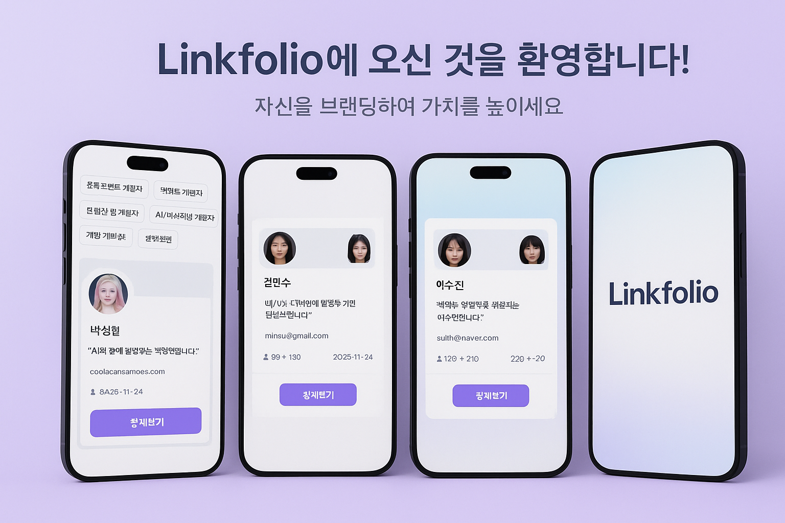
   
   
  
  &nbsp; 
  &nbsp;
  

---

## 목차
1. [📋 프로젝트 개요](#-프로젝트-개요)
2. [🎯 앱 주요 기능](#-앱-주요-기능)
3. [🏗️ 시스템 아키텍처](#️-시스템-아키텍처)
4. [🛠️ 기술 스택](#️-기술-스택)
5. [🚀 고도화 구현 기술](#-고도화-구현-기술)
6. [📊 테스트 및 성능 개선](#-테스트-및-성능-개선)
7. [🔥 트러블 슈팅](#-트러블-슈팅-troubleshooting)
8. [👥 팀원 구성 및 역할](#-팀원-구성-및-역할)

---

## 📋 프로젝트 개요
### **"파편화된 개발자의 경험을 하나로, LinkFolio"**

현대 채용 시장에서 개발자의 이력은 GitHub, 기술 블로그, LinkedIn 등으로 분산되어 관리의 번거로움이 존재합니다. **LinkFolio**는 이러한 **정보의 파편화(Fragmentation)를 해결**하고, 구직자가 자신의 전문성을 효과적으로 증명할 수 있도록 돕는 **퍼스널 브랜딩 및 채용 통합 관리 플랫폼**입니다.

단순한 링크 모음(Link-in-Bio) 서비스를 넘어, 프로젝트 경험과 기술 스택을 시각적으로 구조화하여 보여줍니다. 또한, 기업과 구직자가 직접 소통할 수 있는 **실시간 채팅**과 **커뮤니티** 기능을 통해, 정적인 이력서 제출 방식을 넘어선 **양방향 채용 생태계**를 지향합니다.

---
## 🎯 앱 주요 기능

### 1. 회원가입 및 계정 관리 (Authentication)

  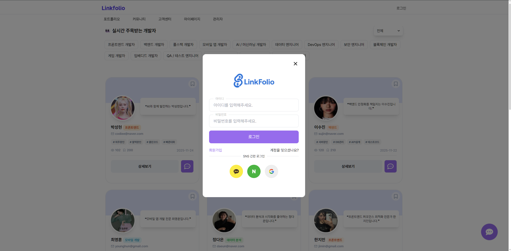
  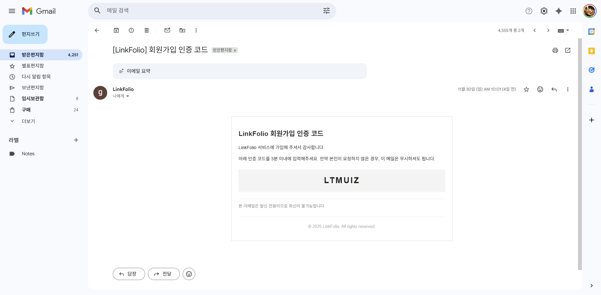

* **회원가입 & 이메일 인증**: 사용자는 이메일 인증(SMTP)을 거쳐 안전하게 계정을 생성합니다. Redis를 활용하여 인증 코드의 유효 시간을 엄격하게 관리합니다.

  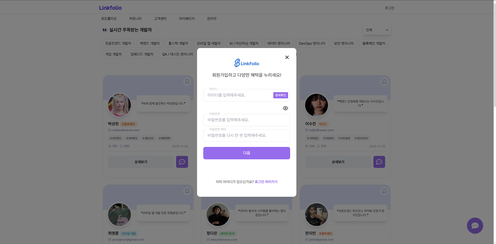
  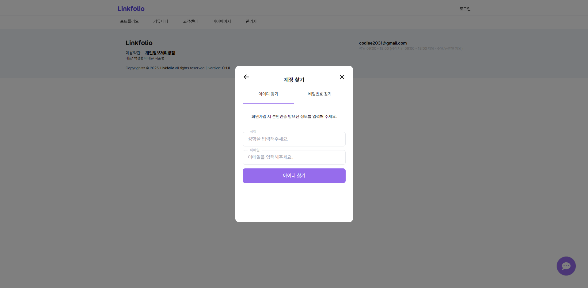
  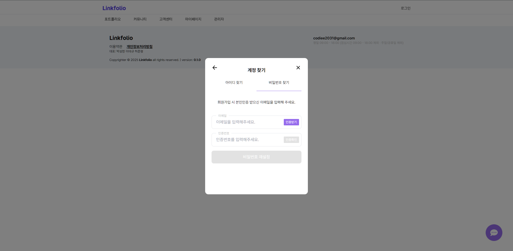

* **로그인 전략**: JWT 기반의 자체 로그인과 OAuth2(Google, Kakao, Naver) 소셜 로그인을 모두 지원하여 접근성을 높였습니다.
* **계정 찾기**: 실명과 이메일 검증을 통해 잊어버린 아이디를 찾거나, 임시 비밀번호 발급 대신 안전하게 비밀번호를 재설정할 수 있는 프로세스를 구현했습니다.

### 2. 포트폴리오

  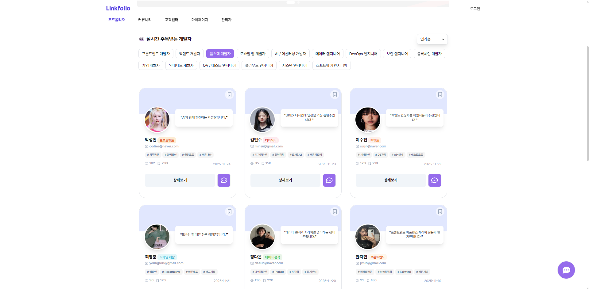
  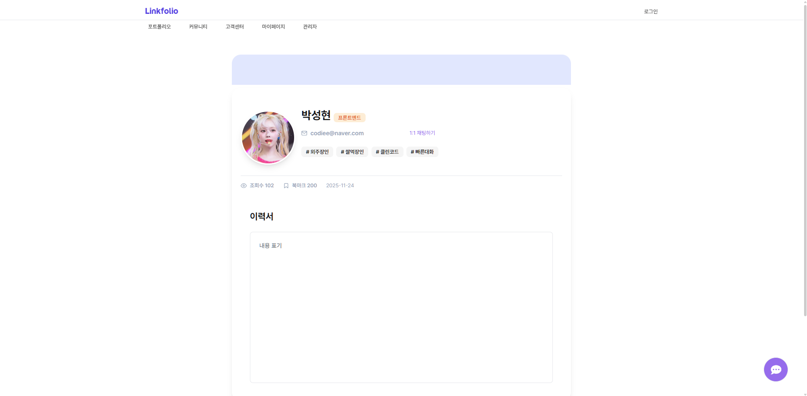

* **인기 개발자 랭킹**: 단순 조회수뿐만 아니라 최신 트렌드를 반영하기 위해 Hacker News의 알고리즘을 변형한 '인기 점수(Popularity Score)' 로직을 적용하여 메인 페이지에 노출합니다.
* **성능 최적화 (Split Caching)**: 포트폴리오 상세 조회 시, 변경이 잦은 동적 데이터(조회수, 좋아요)와 정적 데이터(본문)를 분리하여 캐싱함으로써 DB 부하를 최소화했습니다.
* **필터링**: QueryDSL을 활용하여 직군(Frontend, Backend 등) 및 기술 스택별 동적 필터링을 구현했습니다.

### 3. 커뮤니티

  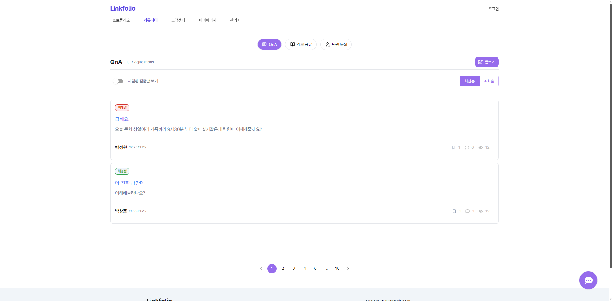
  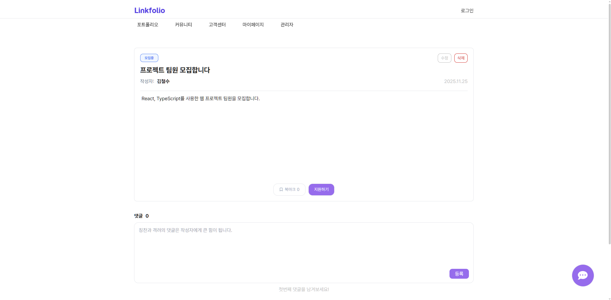
  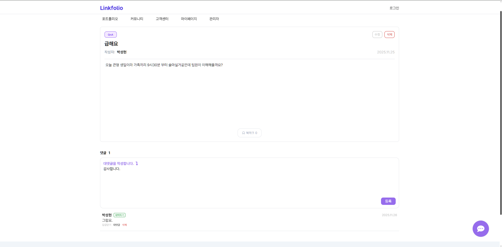

* **카테고리별 게시판**: QnA(질문/답변), 정보 공유, 팀원 모집 등 목적에 맞는 게시판을 제공합니다. QnA 게시판은 질문 해결 여부(`isSolved`)와 답변 채택 기능을 지원합니다.
* **팀원 모집 프로세스**: 작성자는 원클릭으로 모집 상태(`OPEN` ↔ `CLOSED`)를 변경할 수 있으며, 지원자는 게시글 내에서 즉시 작성자와 1:1 채팅을 시작하여 지원할 수 있습니다.
* **계층형 댓글**: 대댓글 구조를 지원하여 사용자 간의 깊이 있는 토론과 소통이 가능합니다.

### 4. 실시간 1:1 채팅

  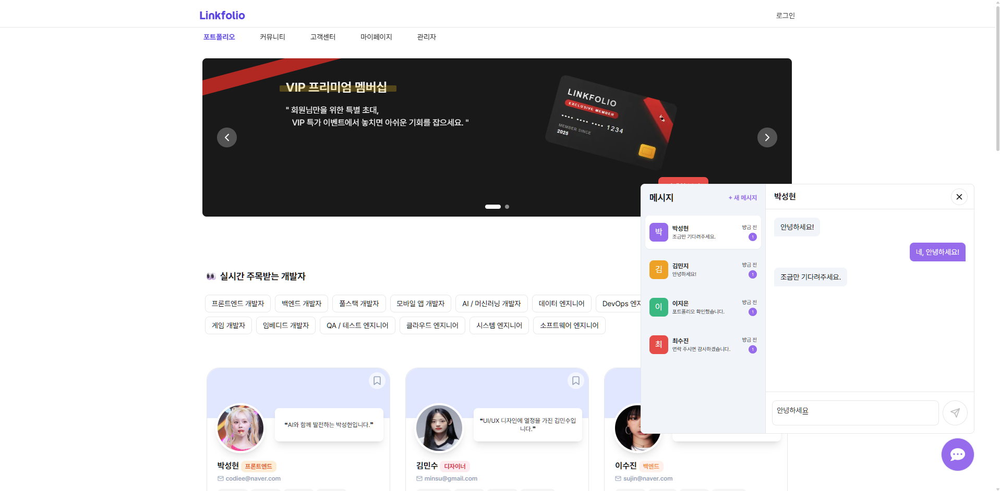

* **실시간 소통**: WebSocket과 STOMP 프로토콜을 활용하여 지연 없는 대화 환경을 제공합니다. Redis Pub/Sub을 도입하여 다중 서버 환경에서도 메시지 전송을 보장합니다.
* **사용자 동기화**: 타 서비스의 프로필 변경 사항을 Kafka CDC로 실시간 동기화하여, 채팅 목록 조회 시 발생하는 N+1 문제를 근본적으로 해결했습니다.

### 5. 고객센터

  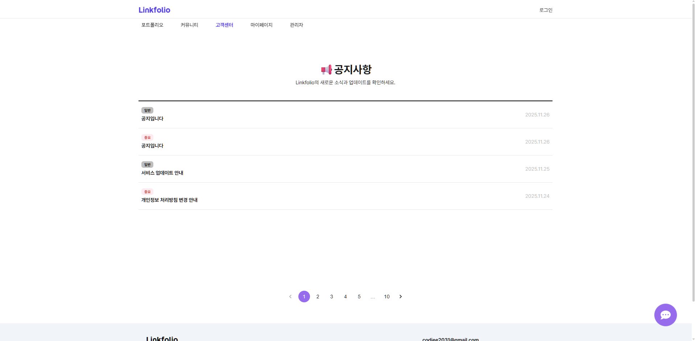
  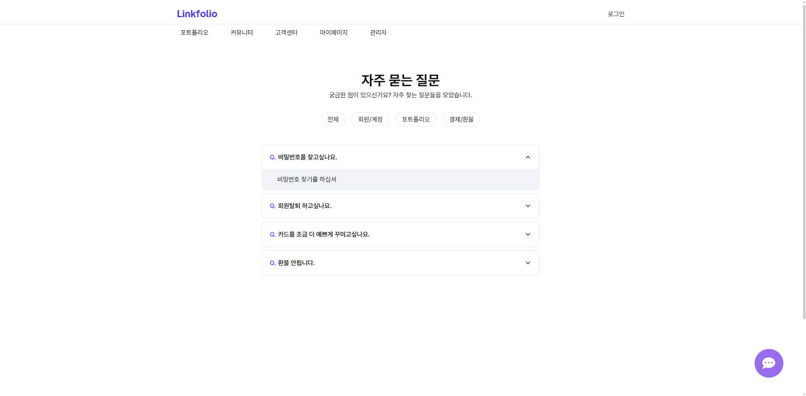

* **공지사항 및 FAQ**: 서비스 이용에 필요한 정보를 제공합니다. 읽기 요청이 많은 특성을 고려하여 Redis Caching을 적극적으로 활용, 조회 성능을 극대화했습니다.

  
  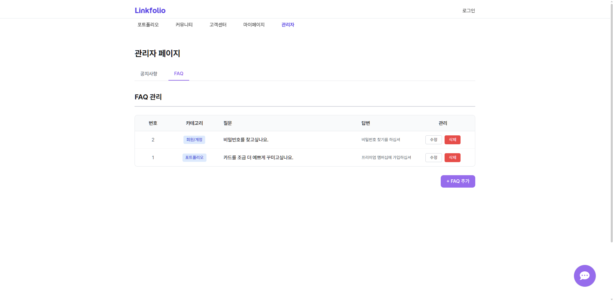

* **관리자 기능**: 관리자(Admin) 권한을 가진 사용자만이 공지사항을 작성 및 수정할 수 있도록 권한을 분리했습니다.

### 6. 마이페이지

  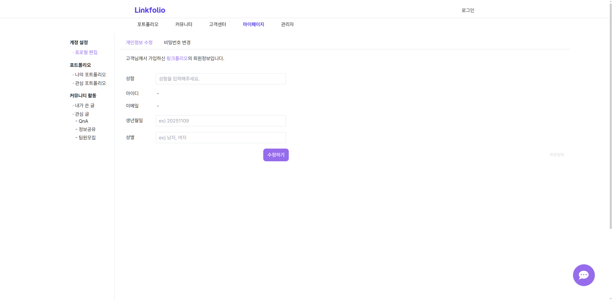
  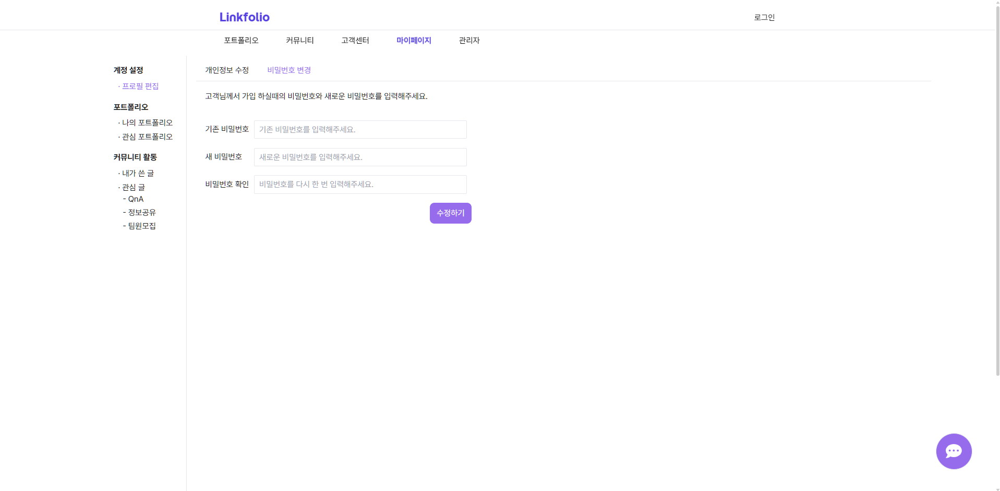

* **내 정보 관리**: 프로필 사진, 실명, 생년월일 등의 개인 정보를 수정할 수 있습니다. 변경된 정보는 Kafka 이벤트를 통해 타 서비스(`Portfolio`, `Chat`)에 실시간으로 전파되어 데이터 일관성을 유지합니다.

  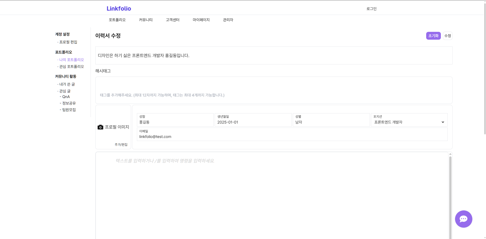
  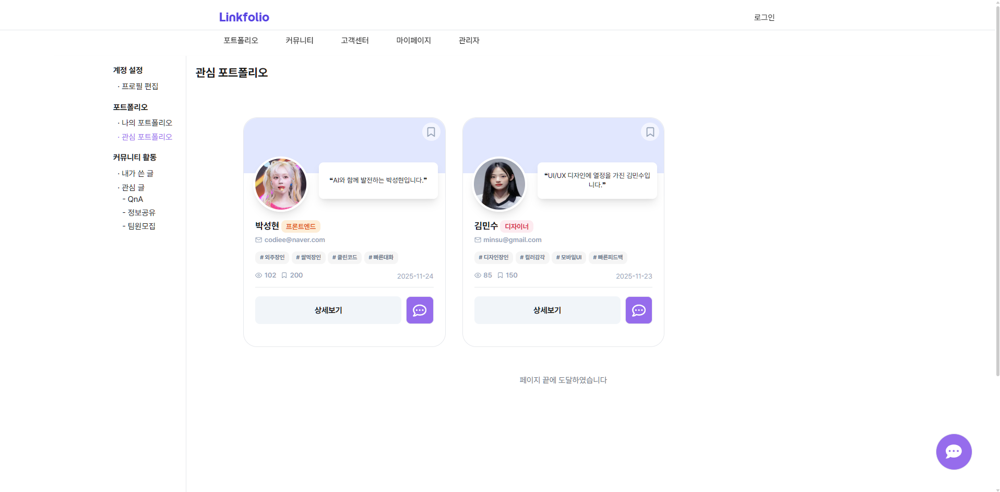

* **포트폴리오 관리**: 작성한 포트폴리오의 공개/비공개 전환 및 수정 기능을 제공하여 이력 관리를 돕습니다.

  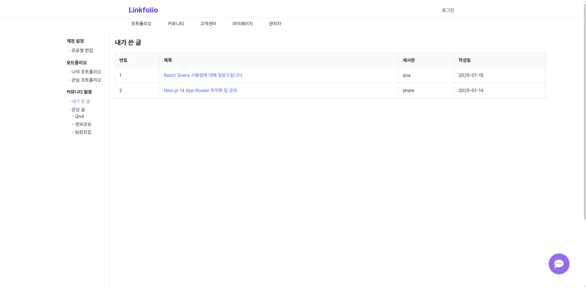
  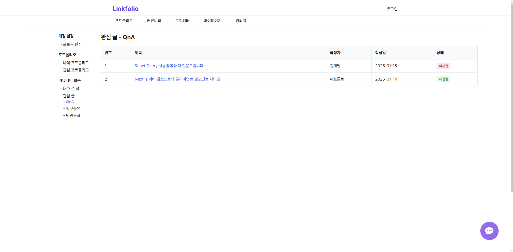

* **활동 내역 조회**: 내가 작성한 커뮤니티 게시글과 북마크한 포트폴리오/게시글을 한눈에 모아볼 수 있어, 관심 콘텐츠를 효율적으로 관리할 수 있습니다.

---

## 🏗️ 시스템 아키텍처

LinkFolio는 **On-Premise Kubernetes** 환경과 **외부 메시징 인프라**가 결합된 하이브리드 아키텍처로 구성되어 있습니다.

  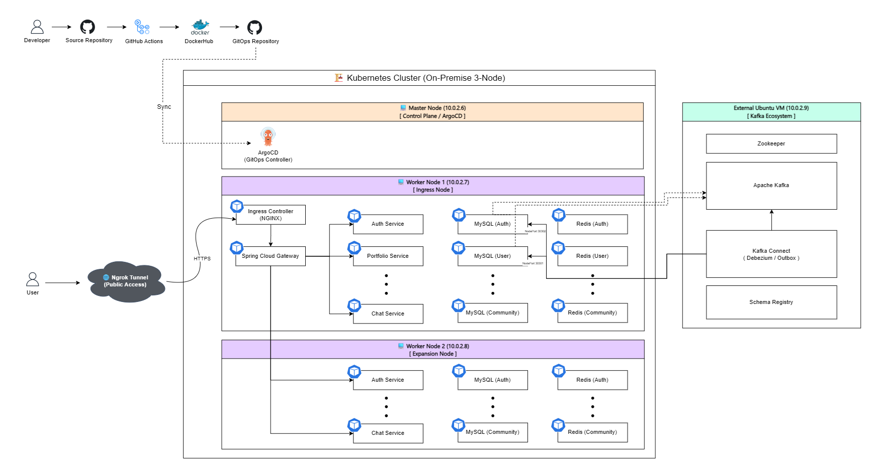

### 🌍 인프라 설계 및 배포 전략 (Infrastructure & Deployment)

#### 1. Hybrid Cloud Topology
시스템의 안정성과 리소스 효율성을 위해 **Kubernetes 클러스터**와 **메시징 시스템**을 물리적으로 분리하여 구축했습니다.

* **Kubernetes Cluster (Self-Hosted On-Premise)**
  * **VirtualBox VM** 위에 3개의 노드(1 Master, 2 Worker)로 구성된 클러스터를 직접 구축하여 운영합니다.
  * 모든 마이크로서비스와 데이터베이스가 이곳에서 구동되며, `NodePort`를 통해 외부 네트워크(Kafka VM)와 통신합니다.
* **External Messaging Server (Ubuntu VM)**
  * Kafka, Zookeeper, Kafka Connect 등 이벤트 브로커 생태계가 독립된 환경에서 운영됩니다.
  * K8s 리소스 부하와 격리된 환경에서 안정적인 메시지 처리를 보장합니다.

#### 2. GitOps Workflow (ArgoCD)
* **ArgoCD**가 Manifest 리포지토리(`linkfolio-manifest`)를 감시하며, 변경 사항 발생 시 Kubernetes 클러스터의 상태를 자동으로 동기화(Sync)합니다.

### 💻 인프라 설계 상세 (Infrastructure Details)
운영 환경에 대한 깊은 이해를 위해 관리형 도구(Minikube 등)를 사용하지 않고, **VirtualBox VM 기반의 3-Node 클러스터**를 구축했습니다.

| 항목 | 구성 내용                         | 비고 |
| :--- |:------------------------------| :--- |
| **OS / Environment** | Ubuntu 22.04 LTS (VirtualBox) | 1 Master + 2 Worker Nodes |
| **Provisioning** | **Kubeadm**, Kubelet, Kubectl | 클러스터 수동 프로비저닝 |
| **Container Runtime** | **Containerd**                | Docker Shim 제거 트렌드 반영 (CRI 표준 준수) |
| **Network (CNI)** | **Calico**                    | Pod 네트워크 통신 및 정책 관리 |
| **Node Spec** | 2GB RAM, 1 vCPU per Node      | Swap 비활성화 및 Kernel 파라미터 튜닝 |

> 👉 **[[Blog] VirtualBox 기반 On-Premise Kubernetes 3-Node 클러스터 구축 과정 상세 보기](https://receiver40.tistory.com/52)**
### ⚡️ Messaging Infrastructure
데이터 파이프라인의 안정성을 보장하기 위해 다음과 같은 컴포넌트들을 구성했습니다.

| Component | Role |
| :--- | :--- |
| **Apache Kafka** | • 이벤트 브로커 (Topic 파티셔닝을 통한 병렬 처리) |
| **Kafka Connect** | • DB와 Kafka 간의 데이터 파이프라인 구축 (Source Connector) |
| **Schema Registry** | • **Avro Serialization**을 통한 스키마 검증 및 데이터 타입 안정성 보장 |
| **Debezium** | • MySQL Binlog를 감지하여 실시간 데이터 변경 사항 캡처 (CDC) |

---

## 🛠️ 기술 스택

| Category | Technology |
| :--- | :--- |
| **Frontend** |      |
| **Backend** |       |
| **Database** |    |
| **Messaging** |    |
| **Infra & DevOps** |      |
| **Monitoring** |    |
| **Tools** |     |

---

## 🚀 고도화 구현 기술
> 본 프로젝트의 주요 고도화 구현 기술을 요약합니다. 상세 설계 및 구현 내용은 아래에 있는 `'서비스 구성 및 상세 문서'`를 확인해주세요.

### 1. Kafka & Debezium 기반의 Event-Driven Architecture
- **문제:** 서비스 간 강한 결합도와 데이터 불일치, 그리고 'Dual Write' 문제.
- **해결:** DB 트랜잭션 로그를 감지하는 **Debezium(CDC)** 을 도입하여 데이터 파이프라인을 구축.
  - **CDC Pattern (`user-profile-connector`):** `User Service`의 프로필 변경 사항(Update)을 실시간으로 감지하여 `Chat`, `Portfolio` 서비스로 자동 전파.
- **효과:** Feign Client 호출 제거를 통한 장애 격리 및 서비스 간 결합도 최소화.

### 2. Split Caching Strategy (Portfolio Service)
- **문제:** 포트폴리오 상세 조회 시 빈번한 DB 부하 발생.
- **해결:** 변경 주기가 다른 데이터를 분리하여 캐싱.
  - **정적 데이터(본문):** Redis Cache-Aside 패턴 (TTL 1시간)
  - **동적 데이터(조회수/좋아요):** Redis Write-Back 패턴 (실시간 인메모리 연산 후 배치 동기화)
- **성과:** 상세 조회 성능 최적화 및 DB Write Lock 최소화.

### 3. 대규모 실시간 채팅 시스템 (Chat Service)
- **구조:** `WebSocket` + `STOMP` + `Redis Pub/Sub` + `MongoDB`
- **특징:**
  - Gateway에서 검증된 `X-User-Id`를 WebSocket Handshake 단계에서 가로채어 세션에 주입, 완벽한 인증 처리.
  - Redis Pub/Sub을 통해 Scale-out 된 서버 환경에서도 메시지 실시간 전송 보장.
  - 사용자 프로필을 로컬 MongoDB(`chat_user_profile`)에 캐싱하여 목록 조회 시 N+1 문제 해결.

### 4. SAGA 패턴을 이용한 분산 트랜잭션
- **시나리오:** 회원가입 시 `Auth DB`(계정)와 `User DB`(프로필)의 원자성 보장 필요.
- **해결:** **Transactional Outbox Pattern**을 적용한 Orchestration 기반 SAGA 구현.
  1. **Event Router (`auth-outbox-connector`):** 비즈니스 로직에서 `outbox` 테이블에 이벤트를 기록하면, Debezium이 이를 감지하여 `outbox.event.{EventType}` 토픽으로 라우팅.
  2. **Flow:** Auth Service(Pending) → Kafka → User Service(Create) → Kafka → Auth Service(Completed/Cancelled).
- **효과:** 분산 환경에서의 데이터 일관성 보장 및 보상 트랜잭션 처리.

### 서비스 구성 및 상세 문서

| 서비스 명 | 역할 및 주요 기술 | 상세 문서 |
|:---:|:---|:---:|
| **API Gateway** | • 진입점 관리, 라우팅, JWT 인증/인가 | [바로가기](docs/developer%20guide/1_APIGATEWAY_SERVICE.md) |
| **Auth Service** | • 로그인(OAuth2/Local), 토큰 관리, SAGA 주관 | [바로가기](docs/developer%20guide/2_AUTH_SERVICE.md) |
| **User Service** | • 사용자 프로필 관리, SAGA 참여 | [바로가기](docs/developer%20guide/3_USER_SERVICE.md) |
| **Portfolio Service** | • 포트폴리오 관리, Split Caching 적용 | [바로가기](docs/developer%20guide/4_PORTFOLIO_SERVICE.md) |
| **Community Service** | • 게시판/댓글 관리, Redis Batch 처리 | [바로가기](docs/developer%20guide/5_COMMUNITY_SERVICE.md) |
| **Chat Service** | • 실시간 채팅 (WebSocket + Redis Pub/Sub) | [바로가기](docs/developer%20guide/6_CHAT_SERVICE.md) |
| **Support Service** | • 공지사항/FAQ 관리 (Read-Heavy 캐싱) | [바로가기](docs/developer%20guide/7_SUPPORT_SERVICE.md) |
| **Common Module** | • 공통 DTO, 예외 처리, 유틸리티 | [바로가기](docs/developer%20guide/0_COMMON_MODULE.md) |

---

## 📊 테스트 및 성능 개선
> 본 프로젝트 서비스(모듈)들의 전체적인 성능 지표를 보여줍니다. 각 서비스별 부하 테스트 시나리오, 병목 구간 분석 및 구체적인 튜닝 과정은 아래 `'상세 분석 보고서'` 에서 확인하실 수 있습니다.

  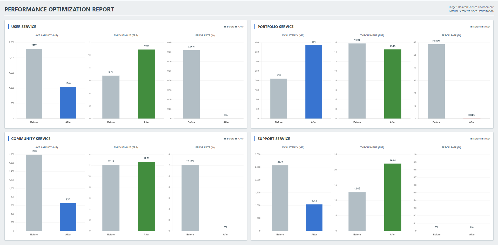

### 통합 성능 개선 요약표

| 서비스                   | 지표               | Before  | After   | 개선 효과                   |
| ------------------------ | ------------------ | -------- | -------- | ---------------------------- |
| **User Service** | 평균 응답시간 (ms) | 2287.37 | 1040.11 | ▼ **54.5% 감소** |
|                          | 처리량 (TPS)       | 6.78    | 10.90   | ▲ **60.7% 증가** |
|                          | 오류율 (%)         | 0.36    | 0.00    | ▼ **100% 감소** |
| **Portfolio Service** | 평균 응답시간 (ms) | 210.08  | 385.60  | ▲ **83.5% 증가** |
|                          | 처리량 (TPS)       | 15.81   | 14.56   | ▼ **7.8% 감소** |
|                          | 오류율 (%)         | 58.62   | 0.04    | ▼ **99.9% 감소** |
| **Community Service** | 평균 응답시간 (ms) | 1796.24 | 656.58  | ▼ **63.4% 감소** |
|                          | 처리량 (TPS)       | 12.13   | 12.62   | ▲ **4.0% 증가** |
|                          | 오류율 (%)         | 12.13   | 0.00    | ▼ **100% 감소** |
| **Support Service** | 평균 응답시간 (ms) | 2579.43 | 1043.60 | ▼ **59.5% 감소** |
|                          | 처리량 (TPS)       | 12.65   | 22.04   | ▲ **74.2% 증가** |
|                          | 오류율 (%)         | 0.00    | 0.00    | ■ 변화 없음                 |

> **💡 Note (Portfolio Service):** 평균 응답 시간의 증가는 **시스템 안정화에 따른 Trade-off**입니다. 개선 전(Before)에는 58%의 요청이 즉시 오류를 반환(Fail-fast)하여 시간이 짧게 측정되었으나, 개선 후(After)에는 정상적인 비즈니스 로직(캐싱 및 DB 조회)을 수행하게 되어 실제 처리 시간이 반영된 결과입니다.

### 상세 분석 보고서

|          주제           | 분석 내용 요약 |                             상세 문서                              |
|:---------------------:|:---|:--------------------------------------------------------------:|
|   **User Service** | • **DB Lock 해소**: 프로필 수정 트랜잭션 최적화 및 커넥션 풀 튜닝 |   [바로가기](docs/analyze%20test/user_service_perf_analysis.md)    |
| **Portfolio Service** | • **Split Caching 효과**: 정적/동적 데이터 분리 캐싱 전략의 Trade-off 분석 | [바로가기](docs/analyze%20test/portfolio_service_perf_analysis.md) |
| **Community Service** | • **조회수 동기화**: Redis HyperLogLog 및 배치 처리를 통한 DB 부하 감소 | [바로가기](docs/analyze%20test/community_service_perf_analysis.md) |
|  **Support Service** | • **Read-Heavy 최적화**: `@Cacheable` 전략과 캐시 만료 정책(TTL) 튜닝 |  [바로가기](docs/analyze%20test/support_service_perf_analysis.md)  |

---

## 🔥 트러블 슈팅 (Troubleshooting)
> 개발 과정에서 마주친 주요 기술적 난관과 이를 해결한 자세한 과정은 아래 `'트러블 슈팅 문서'`를 참고해주세요.

### 트러블 슈팅 문서
| 주제 | 이슈 및 해결 요약 | 상세 문서 |
|:---:|:---|:---:|
| **API Gateway** | • **JWT 버전 불일치**: 서비스 간 라이브러리 버전 차이로 인한 인증 실패 해결 | [바로가기](docs/trouble%20shooting/gateway-jwt-auth-failure.md) |
| **OAuth2 / Redis** | • **직렬화 이슈**: OAuth2 인증 객체의 Redis 저장 시 역직렬화 실패 해결 | [바로가기](docs/trouble%20shooting/oauth2-redis-serialization-issue.md) |
| **QueryDSL** | • **멀티 모듈 상속**: 공통 모듈(`BaseEntity`)의 상속 필드 미인식 문제 해결 | [바로가기](docs/trouble%20shooting/querydsl-baseentity-inheritance-issue.md) |
| **WebSocket** | • **보안 컨텍스트**: STOMP 연결 시 인증 객체(`Principal`) 유실 문제 해결 | [바로가기](docs/trouble%20shooting/websocket-stomp-principal-loss-issue.md) |
| **Redis Cache** | • **Page 객체 캐싱**: `Page<T>` 직렬화 시 `ClassCastException` 해결 | [바로가기](docs/trouble%20shooting/redis-cache-serialization-issue.md) |
| **Dependency** | • **라이브러리 충돌**: Swagger와 Kafka Avro Serializer 간 의존성 충돌 해결 | [바로가기](docs/trouble%20shooting/swagger-dependency-conflict-issue.md) |

---

## 👥 팀원 구성 및 역할

<table>
  <tr>
    <td align="center" width="50%">
      
       
      <h3>허준형</h3>
    </td>
    <td align="center" width="50%">
      
       
      <h3>박성현</h3>
    </td>
  </tr>
  <tr>
    <td valign="top">
       
      <b>🛠 Architecture & DevOps</b> 
      - MSA 환경 구축 및 시스템 아키텍처 설계 
      - On-Premise Kubernetes 클러스터 구축 
      - GitHub Actions & ArgoCD 기반 GitOps 구현 
       
      <b>💻 Backend Development</b> 
      - Kafka 기반 Event-Driven 데이터 동기화 처리 
      - Polyglot Persistence (MySQL, MongoDB, Redis) 설계 
    </td>
    <td valign="top">
       
      <b>🎨 Frontend Development</b> 
      - Next.js 기반 웹 클라이언트 아키텍처 설계 
      - 전역 상태 관리 및 렌더링 최적화 (SSR/CSR) 
      - WebSocket 클라이언트 연동 및 실시간 처리 
       
      <b>✨ UI/UX Design</b> 
      - 사용자 중심 서비스 플로우 및 인터페이스 설계 
      - 반응형 웹 디자인 및 인터랙티브 컴포넌트 개발 
       
    </td>
  </tr>
</table>