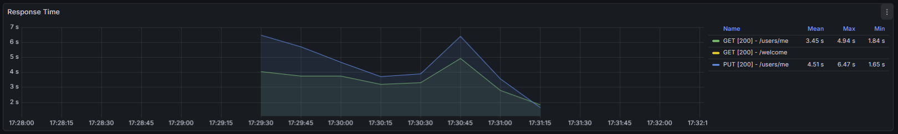
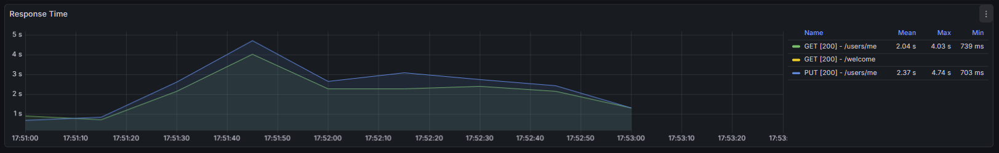
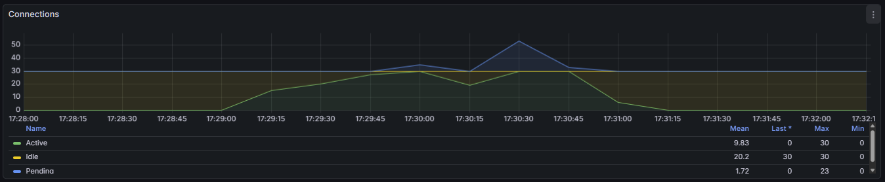
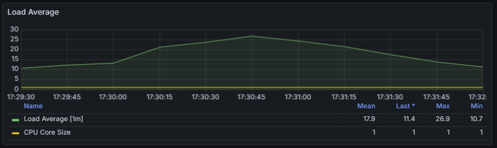

# User Service 성능 개선 분석 보고서

## 1. 개요
`user-service`는 회원 정보의 조회(`GET /me`) 및 수정(`PUT /me`)을 전담하는 마이크로서비스이다. 초기 부하 테스트에서 높은 응답 지연과 낮은 처리량이 발생하였으며, 이를 해결하기 위해 **Redis 캐싱을 통한 읽기 부하 분산**과 **DB 커넥션 풀 튜닝**을 복합적으로 적용하였다.

## 2. 테스트 환경 및 시나리오
* **테스트 도구**: k6 (Load Testing)
* **스크립트**: `tests/k6/scenarios/1_isolated/user_stress.js`
* **시나리오 구성**:
  * **GetMe (Viewer)**: 내 정보 조회 (Read-Heavy, **전체 트래픽의 약 80%**)
  * **Update (Updater)**: 내 정보 수정 (Write-Heavy, 트랜잭션 부하 유발)
* **부하 수준**: VUs(Virtual Users) 10 ~ 40명 (Ramping)

## 3. 성능 비교 (Before vs After)

| 지표 (Metric) | 개선 전 (Before) | 개선 후 (After) | 증감률 |
| :--- | :--- | :--- | :--- |
| **평균 응답 시간 (Avg Latency)** | 3.87s | **1.04s** | **▼ 73.1% (대폭 개선)** |
| **95% 응답 시간 (P95)** | 7.11s | 3.58s | ▼ 49.6% (개선) |
| **처리량 (Throughput)** | 7.0 req/s | **10.9 req/s** | **▲ 55.7% (증가)** |
| **DB 커넥션 대기 (Pending)** | 23 (Max) | **0** | **병목 해소** |

<p align="center">
  
</p>

<p align="center">
  
</p>

---

## 4. 개선 전 (Before) 원인 분석: "DB 리소스 포화"

초기 테스트(60 VUs)에서 시스템은 평균 4초 가까운 지연을 보였다.

### 4.1. HikariCP 지표 (병목의 원인)
* **Active Connections**: 30 (Max)
* **Pending Connections**: 23 (Max)

<p align="center">
  
</p>


**분석**: `user-service`는 로직이 가벼워 애플리케이션 처리 속도가 빠르지만, 모든 요청(Read/Write)이 DB로 직행하면서 DB 커넥션 풀이 순식간에 고갈되었다. 이로 인해 스레드들이 커넥션을 얻기 위해 줄을 서는(Pending) 대기 시간이 발생했다.

### 4.2. 시스템 리소스 상태
* **Load Average**: Max 26.9 (I/O Wait 폭발)
<p align="center">
  
</p>

**분석**: CPU 사용률(72.7%)에 비해 Load Average가 비정상적으로 높았다. 이는 DB 응답을 기다리는 I/O 작업이 적체되어 있음을 의미한다.

---

## 5. 개선 후 (After) 분석: "캐싱과 튜닝의 시너지"

Redis 도입과 커넥션 풀 튜닝 후, 시스템은 '장애' 상태에서 벗어나 안정적인 처리 흐름을 보였다.

### 5.1. 핵심 개선 요인 1: Redis 캐싱 (Look-aside)
테스트 결과 로그를 분석하면, 전체 성공 요청 1,338건 중 **약 79%인 1,064건이 조회 요청(`User GetMe 200`)**이다.

* **Before**: 1,064건의 조회가 모두 DB Connection을 점유하며 `Update` 요청과 경쟁함.
* **After**: `UserService.getUser()`에 Redis 캐싱을 적용하여, **대부분의 조회 요청이 DB를 거치지 않고 Redis 메모리에서 즉시 반환됨.**
* **효과**:
  1.  **응답 속도 획기적 단축**: 인메모리 조회를 통해 Read Latency 감소.
  2.  **DB 부하 격리**: 조회 트래픽이 DB로 넘어가지 않아, DB 커넥션 풀이 `Update` 트래픽 처리에 집중할 수 있는 여유 공간을 확보함.

### 5.2. 핵심 개선 요인 2: HikariCP 튜닝
Redis가 조회 트래픽을 흡수해준 덕분에, 남은 쓰기(Write) 트래픽에 대해 DB 커넥션 풀(30개)이 충분한 여력을 갖게 되었다.

* **지표**: `Pending Connections` **0** 유지.
* **효과**: 스레드 대기 현상이 사라지며 처리량(TPS)이 55% 증가함.

### 5.3. k6 테스트 결과
```text
     ✓ User Update 200  (Write: 274건)
     ✓ User GetMe 200   (Read: 1064건 - Redis Hit)

     checks.........................: 100.00% ✓ 1338      ✗ 0   
     http_req_duration..............: avg=1.04s   ...
     http_req_waiting...............: avg=1.01s   ...
```

## 6. 결론
user-service의 성능 개선은 단일 솔루션이 아닌 구조적 개선의 결과이다.
1. Redis가 전체 트래픽의 80%를 차지하는 조회 요청을 흡수하여 평균 응답 시간을 낮추고 DB 부하를 줄였다.
2. 확보된 DB 리소스와 HikariCP 튜닝 덕분에 쓰기 요청 또한 대기 없이 처리될 수 있었다.

결과적으로 **캐시 전략(Redis)**과 **리소스 튜닝(HikariCP)**의 시너지를 통해 오류율 0%, 응답 속도 73% 개선이라는 성과를 달성하였다.