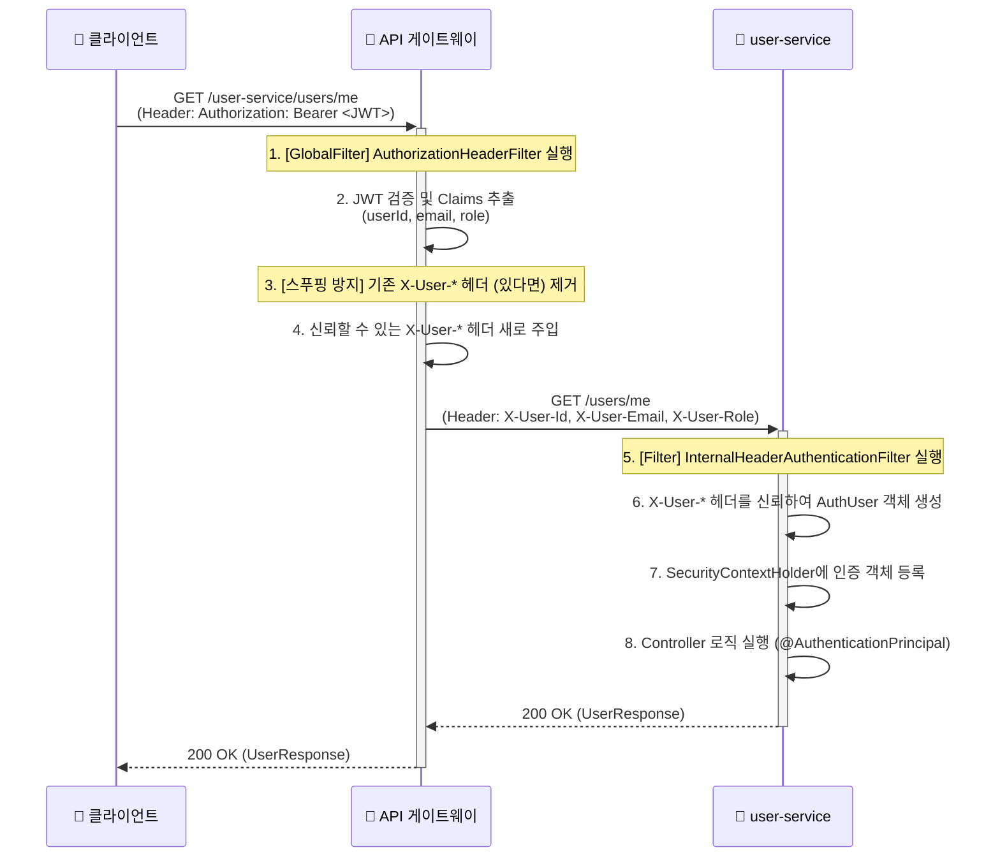

## 1. 개요
 - `apigateway-service`는 LinkFolio 백엔드 마이크로서비스 아키텍처(MSA)의 단일 진입점(Single Point of Entry) 역할을 수행하는 API 게이트웨이 서비스
 - 모든 외부 클라이언트(웹, 앱)의 요청은 이 게이트웨이를 통과
 - 요청을 인증하고 내부의 적절한 마이크로서비스(예: `user-service`, `auth-service`, `portfolio-service`, `chat-service`)로 라우팅하는 책임
 - 주요 기술 스택으로는 Spring Cloud Gateway를 사용하여 비동기/논블로킹(Non-Blocking) 방식의 반응형(Reactive) 시스템으로 구축되었다.

---

## 2. 핵심 설정 (application.yml)

### 2.1. forward-headers-strategy: NATIVE

`application.yml`에 설정된 `server.forward-headers-strategy: NATIVE`는 게이트웨이가 자신을 호출한 **앞단의 리버스 프록시(예: Kubernetes Ingress, Nginx, 로드 밸런서)를 신뢰**하도록 지시하는 핵심 설정이다.

- **필요성**: 클라이언트 요청(예: `https://linkfolio.com`)은 게이트웨이로 직접 도달하는 것이 아니라, 로드 밸런서를 먼저 거친다. 로드 밸런서는 HTTPS 요청을 받아 SSL/TLS 처리를 종료(SSL Termination)한 후, 게이트웨이로는 암호화되지 않은 내부 HTTP 요청(예: `http://apigateway-service:8000`)을 보낸다.
- **기본 문제**: 이 설정을 사용하지 않으면(`NONE`이 기본값), 게이트웨이는 자신을 호출한 로드 밸런서의 **내부 IP**와 **HTTP 프로토콜**만을 인식하게 된다. 원래 클라이언트의 IP 주소와 HTTPS 프로토콜 정보는 유실된다.

- **동작**: `NATIVE` 전략은 로드 밸런서가 요청 헤더에 추가해주는 표준 `X-Forwarded-*` 헤더들을 신뢰하고 파싱하라고 Spring에 지시한다.
  * `X-Forwarded-For`: 실제 클라이언트의 IP 주소
  * `X-Forwarded-Proto`: 원래 요청의 프로토콜 (http 또는 https)
  * `X-Forwarded-Host`: 원래 요청의 호스트명 (예: `linkfolio.com`)

- **미사용 시 문제점**:
  1.  **부정확한 로그**: 모든 로그에 클라이언트 IP가 로드 밸런서의 내부 IP로 기록되어, 장애 추적이나 어뷰징 대응이 불가능해진다.
  2.  **리디렉션 및 Swagger UI 오류**: 게이트웨이가 자신에게 온 요청이 `http://`라고 착각한다. 사용자가 `https://.../swagger-ui.html`로 접속해도, Swagger UI가 API 명세를 로드하기 위해 요청하는 URL(`api-docs`)을 `http://.../api-docs`로 잘못 생성하여 반환한다. 브라우저는 보안 페이지(`https://`)에서 비보안 리소스(`http://`)를 로드하려는 시도를 **'혼합 콘텐츠(Mixed Content)'** 오류로 간주하고 차단하여 UI가 깨지게 된다.
  3.  **IP 기반 보안 기능 오작동**: IP 기반 차단 또는 요청 제한(Rate Limiting) 기능이 모두 로드 밸런서의 IP를 기준으로 동작하여 보안 정책이 무력화된다.

### 2.2. CORS (Cross-Origin Resource Sharing)
`globalcors` 설정을 통해 모든 경로(`[/**]`)에 대해 특정 프론트엔드 오리진(예: `localhost:3000`, Vercel 배포 주소)에서의 요청을 허용하도록 설정하였다.
`allow-credentials: true` 설정을 통해 인증과 관련된 쿠키(예: Refresh Token)도 주고받을 수 있도록 허용한다.

### 2.3. 라우팅 (Routes)
각 마이크로서비스로 요청을 중계하는 규칙이다.

 - `user-service-route`: `/user-service/**` 경로의 요청을 `http://user-service:80` (쿠버네티스 내부 서비스 DNS)로 전달한다.
 - `auth-service-route`: `/auth-service/**` 경로의 요청을 `http://auth-service:80`으로 전달한다.
 - `portfolio-service-route`: `/portfolio-service/**` 경로의 요청을 `http://portfolio-service:80`으로 전달한다.
 - `chat-service-route`: `/chat-service/**` 경로의 요청을 `http://chat-service:80`으로 전달한다.
 - `chat-service-ws-route`: `/ws-chat/**` 경로의 WebSocket 요청을 `http://chat-service:80`으로 전달한다.

### 2.4. 인증 제외 경로 (Excluded URLs)

`app.gateway.excluded-urls` 목록에 포함된 경로는 `AuthorizationHeaderFilter`의 인증 검사를 통과(bypass)한다.

주로 회원가입, 로그인, 토큰 재발급, 아이디/비밀번호 찾기 등 인증 이전에 수행되어야 하는 API들과, 인증이 필요 없는 포트폴리오 목록/상세 조회 API(`portfolio-service/portfolios/**`)가 여기에 해당한다.

---

## 3. 인증 필터 (AuthorizationHeaderFilter.java)
이 필터는 게이트웨이의 핵심 보안 로직을 담당한다.

### 3.1. 필요성
MSA 구조에서 각 서비스(`user-service`, `portfolio-service` 등)가 개별적으로 JWT 토큰을 검증하는 것은 비효율적이며 보일러플레이트 코드를 증가시킨다. 게이트웨이가 앞단(Proxy)에서 중앙 인증 지점 역할을 맡아, 유효한 JWT 토큰을 가진 요청만 내부 서비스로 전달하도록 한다. 내부 서비스들은 게이트웨이를 통과한 요청을 '신뢰'할 수 있게 된다.

### 3.2. 동작 원리 및 흐름
이 필터는 `GlobalFilter`로 구현되었으며, `Ordered.HIGHEST_PRECEDENCE` (최고 우선순위)를 가져 다른 어떤 필터보다 먼저 실행된다.
(보통 MSA에서는 JWT 토큰을 `HTTP 헤더 방식`으로 처리하거나 `별도의 간소화한 토큰`으로 처리하는데, 본 프로젝트에서는 `HTTP 헤더 방식`을 선택하였다.)

  1. **요청 경로 확인**: 현재 요청의 경로(path)를 가져온다.

  2. **화이트리스트 검사**: isPatchExcluded 메서드를 호출하여, excluded-urls에 등록된 경로인지 확인한다. 만약 등록된 경로라면, 인증 절차 없이 즉시 다음 필터 체인(내부 서비스)으로 요청을 전달한다.

  3. **헤더 존재 여부 검사**: 화이트리스트에 없는 경로일 경우, Authorization 헤더가 있는지 확인한다. 헤더가 없으면 MISSING_AUTH_HEADER 예외를 발생시킨다.

  4. **JWT 추출**: getJwtFromHeader 메서드를 통해 "Bearer " 접두사를 제거하고 순수 JWT 토큰을 추출한다. 형식이 잘못되면 INVALID_AUTH_FORMAT 예외를 발생시킨다.

  5. **JWT 검증 및 파싱**: getClaims 메서드에서 jwtParser (JWT Secret Key로 초기화됨)를 사용하여 토큰의 서명, 만료 시간 등을 검증하고 Payload(Claims)를 추출한다. 검증에 실패하면 INVALID_JWT_TOKEN 예외를 발생시킨다.

  6. **Claims 정보 추출**: Claims에서 subject(userId), email, role 정보를 추출한다.

  7. **내부 헤더 주입**: buildInternalRequest 메서드를 호출하여 새로운 요청(Request)을 생성한다. 이 과정은 스푸핑 공격 방지를 위해 매우 중요하다. (3.3절 참고)
            

  8. **요청 전달**: 새로 생성된 요청을 다음 필터 체인으로 전달한다.

### 3.3. 스푸핑(Spoofing) 공격 방지
- 문제 상황: `user-service`나 `portfolio-service` 같은 내부 서비스들은 게이트웨이가 주입한 내부 헤더(예: `X-User-Id`)를 신뢰하고 사용자 인증을 처리한다. (이는 `common-module`의 `InternalHeaderAuthenticationFilter`를 통해 이루어진다). 만약 악의적인 사용자가 게이트웨이로 요청을 보낼 때, `Authorization` 헤더와 함께 위조된 `X-User-Id: 123` (다른 사용자 ID) 헤더를 같이 보낸다면, 게이트웨이가 이 헤더를 그대로 통과시킬 경우 내부 서비스는 위조된 사용자 ID를 신뢰하여 인가 오류가 발생할 수 있다.

- 해결 방안: `buildInternalRequest` 메서드는 이 문제를 원천 차단한다.
  1. request.mutate().headers(...)를 통해 요청 헤더를 수정한다. 
  2. 외부에서 주입되었을 가능성이 있는 X-User-Id, X-User-Email, X-User-Role 헤더를 명시적으로 모두 제거(remove)한다. 
  3. 또한, 더 이상 필요 없는 Authorization 헤더도 제거한다. 
  4. 오직 JWT 토큰에서 직접 파싱한 신뢰할 수 있는 userId, email, role 값만을 사용하여 X-User-* 헤더를 새롭게 추가(add)한다. 

| 이러한 '제거 후 재주입(Remove-and-Re-add)' 전략을 통해, 내부 마이크로서비스는 오직 게이트웨이가 검증하고 주입한 사용자 정보만을 신뢰할 수 있게 된다.

Q. 로직을 봤을 때, JWT 기반으로 추출한 Claims로 HTTP 헤더에 add를 하고 있는데, 굳이 remove가 없어도 되지 않나?

A. HTTP 헤더는 `다중 값(multi-valued)`을 가질 수 있어서 add를 했을 때 값을 덮어쓰기(overwrite) 하는게 아니라 새로운 값을 추가하는 구조가 된다. 따라서 반드시 remove가 선행되어야 한다.

---

## 4. 예외 처리
`AuthorizationHeaderFilter`에서 인증 관련 예외 발생 시, `onError` 메서드가 호출된다. 이 메서드는 `ErrorCode` Enum에 정의된 상태 코드와 메시지를 기반으로 표준화된 JSON 에러 응답을 생성하여 클라이언트에게 반환한다.

게이트웨이 고유의 ErrorCode는 다음과 같다:

- MISSING_AUTH_HEADER (A001): Authorization 헤더가 누락됨.
- INVALID_AUTH_FORMAT (A002): "Bearer " 접두사가 없거나 형식이 잘못됨.
- INVALID_JWT_TOKEN (A003): JWT 서명 오류, 만료, 형식 오류 등.
- INVALID_JWT_PAYLOAD (A004): JWT 내부에 필수 클레임(userId, email 등)이 누락됨.
- INTERNAL_FILTER_ERROR (A500): 필터 동작 중 예기치 못한 서버 오류.

--- 

## 5. 의존성 관리 (pom.xml)
apigateway-service의 pom.xml은 MSA 게이트웨이 역할에 맞게 신중하게 관리된다.

- `spring-cloud-starter-gateway-server-webflux`: Spring Cloud Gateway의 핵심 의존성. (WebFlux 포함)

- `jjwt-*`: `AuthorizationHeaderFilter`에서 JWT를 파싱하고 검증하기 위해 사용된다. 

- `springdoc-openapi-starter-webflux-ui`: WebFlux 환경에서 Swagger UI를 통합하고, `application.yml`에 정의된 내부 서비스들의 API 문서를 취합하여 보여주는 역할을 한다.

- `common-module`:
  - 게이트웨이는 `common-module`을 의존한다. 이는 ErrorCode 인터페이스, 공통 예외 응답 DTO인 `ErrorResponse` 등을 공유하기 위함이다.
  - 의존성 제외(Exclusion): common-module은 다른 서비스들을 위해 `spring-boot-starter-data-jpa`, `spring-boot-starter-web` (MVC), `spring-boot-starter-security` (MVC용) 의존성을 포함하고 있다. **게이트웨이는 WebFlux 기반이며 데이터베이스가 필요 없으므로, common-module을 가져올 때 이 의존성들을 <exclusions> 태그를 사용하여 모두 제외**한다.
  - 이러한 제외 설정은 `ApigatewayServiceApplication.java의 @SpringBootApplication(exclude = ...)` 설정을 통해서도 재확인되어, JPA 관련 자동 설정이 로드되지 않도록 보장한다.

---

#### 
