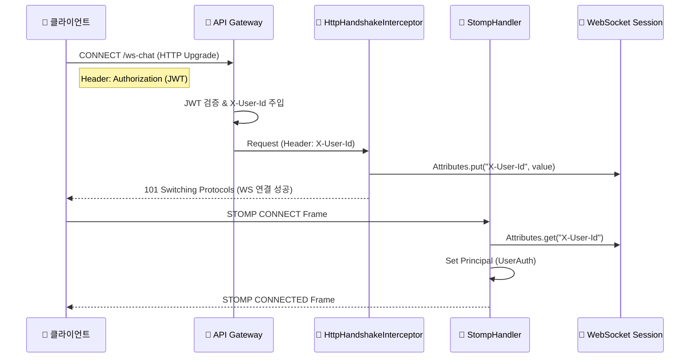
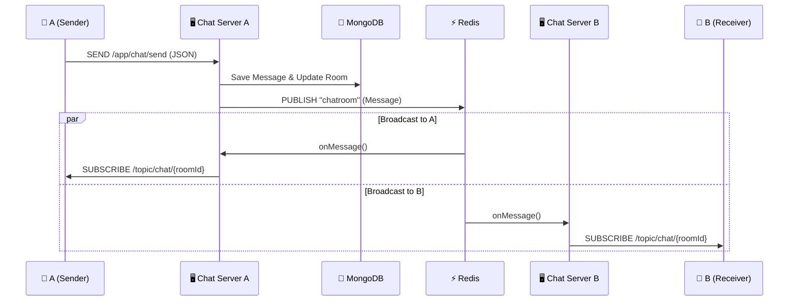
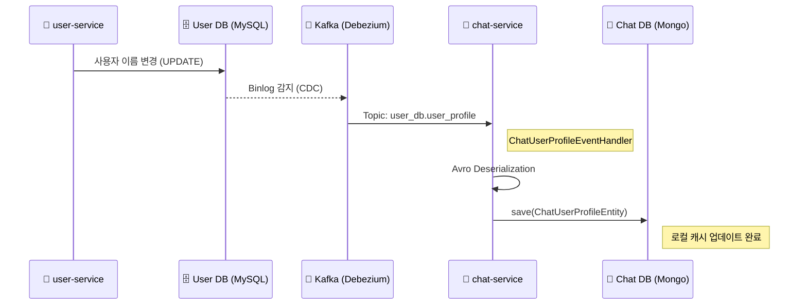

# CHAT_SERVICE.md

## 1. 개요

`chat-service`는 LinkFolio MSA에서 **실시간 1:1 채팅** 및 **메시지 관리**를 전담하는 마이크로서비스이다.

대용량 메시지 처리를 위해 **MongoDB**를 메인 저장소로 사용하며, 다중 서버 환경에서의 실시간성을 보장하기 위해 **WebSocket (STOMP)**과 **Redis Pub/Sub** 아키텍처를 결합하였다.

또한, 타 서비스(`user-service`)와의 결합도를 낮추고 조회 성능을 극대화하기 위해 **Kafka CDC(Change Data Capture)**를 통해 사용자 프로필 정보를 로컬 MongoDB에 동기화(Caching)하여 사용한다.

---

## 2. 핵심 기술 및 특징

* **WebSocket + STOMP**: 양방향 실시간 통신을 위해 표준 WebSocket 위에 메시징 규약인 STOMP를 얹어 사용한다.
* **Redis Pub/Sub**: Scale-out 된 여러 채팅 서버 인스턴스 간에 메시지를 실시간으로 전파(Broadcast)한다.
* **MongoDB**: 스키마 유연성과 대량의 쓰기/읽기 성능을 위해 NoSQL을 사용한다.
* **Kafka CDC (Data Sync)**: `user-service`의 프로필 변경 사항을 실시간으로 수신하여 `chat-service` 내부의 `chat_user_profile` 컬렉션에 동기화한다. (Feign Client 제거)
* **Gateway Header Auth**: WebSocket Handshake 단계에서 Gateway가 검증한 헤더(`X-User-Id`)를 가로채 인증을 처리한다.

---

## 3. 상세 아키텍처 및 데이터 흐름

이 섹션은 프론트엔드 개발자가 채팅 기능을 구현하기 위해 반드시 이해해야 할 흐름을 상세히 기술한다.

### 3.1. 사전 지식 (Prerequisites)

1.  **WebSocket Handshake**: WebSocket 연결은 최초에 **HTTP 프로토콜**로 시작된다(`Upgrade` 헤더 사용). 따라서 최초 연결 시에는 HTTP 헤더를 사용할 수 있다.
2.  **STOMP Protocol**: WebSocket이 연결된 후, 그 위에서 동작하는 텍스트 기반 메시징 프로토콜이다.
3.  **Gateway의 역할**: 클라이언트가 직접 마이크로서비스에 붙는 것이 아니라, API Gateway를 거친다. Gateway는 JWT를 검증하고 `X-User-Id` 헤더를 붙여서 내부 서비스로 넘겨준다.

### 3.2. 연결 및 인증 흐름 (Connection Flow)

가장 중요한 부분은 "JWT 토큰이 있는 상태에서 어떻게 WebSocket 인증을 통과하는가?"이다.

1.  **클라이언트 연결 요청**:
    * 프론트엔드는 `/ws-chat` 엔드포인트로 연결을 시도한다.
    * 이때는 **HTTP 요청**이므로, Gateway가 `Authorization` 헤더를 검증하고 `X-User-Id` 헤더를 주입하여 `chat-service`로 전달한다.
2.  **Handshake Interceptor (`HttpHandshakeInterceptor`)**:
    * `chat-service`는 WebSocket 연결이 맺어지기 직전(Handshake 단계)에 요청을 가로챈다.
    * HTTP 헤더에 있는 `X-User-Id`를 꺼내서, **WebSocket 세션 속성(Attributes)**에 저장한다.
    * 이 단계가 성공해야 물리적인 연결이 수립된다.
3.  **STOMP Connect (`StompHandler`)**:
    * 연결 수립 후, 클라이언트는 STOMP `CONNECT` 프레임을 보낸다.
    * `StompHandler`는 세션 속성에 저장해둔 `X-User-Id`를 꺼내와서, Spring Security의 `Principal`(인증 객체)로 등록한다.
    * 이후의 모든 메시징 작업(Send)에서는 이 `Principal`을 통해 보낸 사람을 식별한다.

### 3.3. 메시지 전송 및 수신 흐름 (Pub/Sub Flow)

사용자 A(Server 1 접속)가 사용자 B(Server 2 접속)에게 메시지를 보내는 상황이다.

1.  **SEND (Client -> Server 1)**:
    * 사용자 A가 `/app/chat/send` 주소로 JSON 메시지를 전송한다.
2.  **Persistence (Server 1)**:
    * `ChatSocketController`가 메시지를 받는다.
    * `ChatService`가 MongoDB에 메시지를 **저장**한다.
3.  **Publish (Server 1 -> Redis)**:
    * 저장이 완료되면 `RedisPublisher`가 `chatroom`이라는 Redis Topic에 메시지를 발행(Publish)한다.
    * 이때 메시지는 직렬화된 JSON 형태이다.
4.  **Subscribe (Redis -> Server 1, Server 2)**:
    * `chatroom` 토픽을 구독하고 있던 모든 채팅 서버(Server 1, Server 2)가 메시지를 수신한다.
5.  **Broadcast (Server 2 -> Client B)**:
    * `RedisSubscriber`는 수신한 메시지의 `roomId`를 확인한다.
    * 자신의 서버에 해당 `roomId`를 구독(`SUBSCRIBE /topic/chat/{roomId}`)하고 있는 클라이언트가 있는지 찾는다.
    * 사용자 B가 Server 2에 붙어있으므로, Server 2는 사용자 B에게 WebSocket으로 메시지를 쏘아준다.

---

## 4. 데이터 모델 (MongoDB)

### 4.1. `ChatRoomEntity` (`chat_room`)
채팅방의 메타데이터를 저장한다.

* **Index**: `{'user1Id': 1, 'user2Id': 1}` (Unique Compound Index) - 항상 `user1Id < user2Id`로 정렬하여 저장, 중복 방 생성 방지.
* **Fields**:
    * `lastMessage`: 목록에 보여줄 미리보기 메시지.
    * `lastReadAt`: `Map<String, LocalDateTime>` - 사용자별 마지막 읽은 시간 (안 읽은 메시지 계산용).

### 4.2. `ChatMessageEntity` (`chat_message`)
실제 대화 내용을 저장한다.

* **Index**: `roomId` (메시지 이력 조회용)
* **Fields**: `senderId`, `content`, `createdAt`, `readCount` 등.

### 4.3. `ChatUserProfileEntity` (`chat_user_profile`) [NEW]
타 서비스(`user-service`)의 사용자 정보를 로컬에 캐싱한 데이터이다.

* **Purpose**: 채팅방 목록 조회 시 상대방의 이름/사진을 보여줘야 하는데, 매번 `user-service`를 호출(Feign)하면 성능 저하가 발생하므로 로컬에 복제본을 둔다.
* **Sync**: `user-service` DB가 변경되면 Kafka CDC를 통해 이 컬렉션이 실시간 업데이트된다.

---

## 5. 주요 기능 구현 상세

### 5.1. 읽지 않은 메시지 수 계산 (Unread Count)
* **Logic**: `ChatMessageRepository.countUnreadMessages`
* `roomId`가 일치하고,
* `senderId`가 내가 아니며 (내가 보낸 건 제외),
* `createdAt`이 `ChatRoomEntity`에 저장된 내 `lastReadAt`보다 큰 메시지의 개수를 센다.

### 5.2. 채팅방 목록 조회 (`GET /chat/rooms`)
이전 버전과 달리 Feign Client를 사용하지 않는다.

1.  MongoDB (`chat_room`)에서 내가 속한 방 목록을 가져온다 (`Slice` 페이징).
2.  방 목록에서 상대방 ID들을 추출한다.
3.  MongoDB (`chat_user_profile`)에서 상대방 프로필 정보를 `In-Query`로 한 번에 조회한다. (성능 최적화)
4.  각 방의 `unreadCount`를 계산하여 DTO로 조합 후 반환한다.

---

## 6. 시퀀스 다이어그램

#### A. 인증 및 연결 (Handshake & Connect)

#### B. 메시지 전송 및 전파 (Redis Pub/Sub)

#### C. 데이터 동기화 (Kafka CDC)
