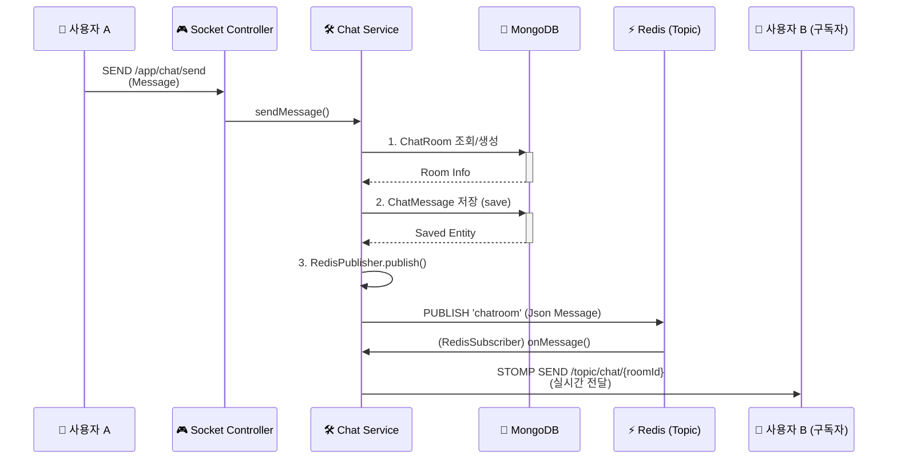
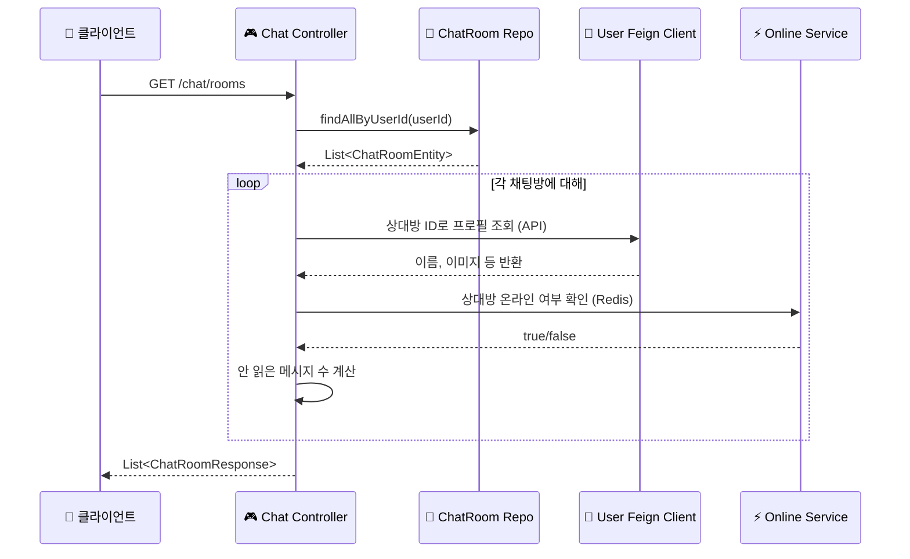

# CHAT_SERVICE.md

## 1. 개요

`chat-service`는 LinkFolio MSA에서 **실시간 1:1 채팅** 및 **메시지 관리**를 전담하는 마이크로서비스이다.

이 서비스는 기존 RDBMS(MySQL) 대신 **MongoDB**를 도입하여 대용량 메시지 데이터를 효율적으로 저장하며, **WebSocket (STOMP)**과 **Redis Pub/Sub** 아키텍처를 결합하여 다중 서버 환경에서도 실시간성(Real-time)을 보장하도록 설계되었다.

주요 책임은 다음과 같다:
1.  **실시간 통신**: WebSocket 연결을 관리하고 메시지를 즉시 전달한다.
2.  **메시지 영속화**: 채팅방 및 메시지 이력을 MongoDB에 저장하고 조회한다.
3.  **상태 동기화**: 사용자의 온라인/오프라인 상태를 관리하고, 읽지 않은 메시지 수(Unread Count)를 계산한다.

---

## 2. 핵심 기능

* **1:1 채팅 (Lazy Creation)**: 메시지 전송 시점에 채팅방이 없으면 자동으로 생성하며, `user1Id < user2Id` 정렬 로직을 통해 방의 중복 생성을 방지한다.
* **Redis Pub/Sub 기반 메시징**: 특정 서버 인스턴스에 종속되지 않고, Redis 토픽(`chatroom`)을 통해 메시지를 모든 구독 인스턴스로 전파(Broadcast)한다.
* **WebSocket 핸드셰이크 인증**: API Gateway가 주입한 헤더(`X-User-Id`)를 가로채 STOMP 세션에 바인딩하여 인증을 유지한다.
* **사용자 상태 관리**: WebSocket 연결/해제 이벤트를 감지하여 Redis에 사용자 접속 상태(`STATUS:{userId}`)를 실시간으로 갱신한다.
* **이력 및 목록 조회**: MongoDB의 인덱싱을 활용한 고성능 페이징(Slice) 조회 및 `user-service` Feign Client를 통한 상대방 프로필 정보 조합.

---

## 3. 아키텍처 및 데이터 흐름

`chat-service`는 HTTP(REST)와 WebSocket 두 가지 통신 프로토콜을 모두 사용한다.

### 3.1. 실시간 메시지 전송 (WebSocket + Redis)

1.  **연결 (Handshake)**: 클라이언트가 `/ws-chat` 엔드포인트로 연결을 시도한다. `HttpHandshakeInterceptor`가 HTTP 헤더의 `X-User-Id`를 추출하여 세션 속성에 저장한다.
2.  **전송 (Send)**: 클라이언트가 `/app/chat/send`로 메시지를 전송하면 `ChatSocketController`가 이를 수신한다.
3.  **저장 (Persist)**: `ChatService`가 메시지를 MongoDB `chat_message` 컬렉션에 저장하고, `chat_room`의 `lastMessage` 등을 갱신한다.
4.  **발행 (Publish)**: 저장 완료 후, `RedisPublisher`가 `chatroom` 토픽으로 메시지를 발행한다.
5.  **수신 및 전달 (Subscribe & Broadcast)**: `RedisSubscriber`가 메시지를 수신하고, `SimpMessageSendingOperations`를 통해 해당 채팅방을 구독 중인(`topic/chat/{roomId}`) 모든 클라이언트에게 메시지를 전달한다.

### 3.2. 채팅방 목록 및 이력 조회 (REST)

1.  **채팅방 목록 (`GET /chat/rooms`)**:
    * MongoDB에서 내 ID가 포함된 모든 채팅방을 `lastMessageTime` 내림차순으로 조회한다.
    * `UserClient` (Feign)를 호출하여 상대방의 최신 프로필 정보(이름 등)를 가져온다.
    * `Redis`를 조회하여 상대방의 현재 접속 상태(Online/Offline)를 확인한다.
    * 각 방별 `unreadCount`를 계산하여 응답한다.
2.  **메시지 이력 (`GET /chat/rooms/{roomId}/messages`)**:
    * MongoDB에서 `roomId`를 기준으로 페이징(Slice) 처리된 과거 메시지를 조회한다.

---

## 4. 데이터 모델 (MongoDB)

NoSQL인 MongoDB를 사용하여 스키마 유연성과 쓰기 성능을 확보했다.

### 4.1. `ChatRoomEntity`

* **Collection**: `chat_room`
* **Index**: `{'user1Id': 1, 'user2Id': 1}` (Unique Compound Index)
* **특징**:
    * `user1Id`와 `user2Id`는 항상 `min(id), max(id)` 순서로 저장되어, A가 B에게 걸든 B가 A에게 걸든 동일한 방을 참조하도록 보장한다.
    * `lastReadAt` (Map): 각 사용자별 마지막 읽은 시간을 저장하여 안 읽은 메시지 수를 계산하는 데 사용된다.

### 4.2. `ChatMessageEntity`

* **Collection**: `chat_message`
* **Index**: `roomId` (조회 성능 최적화)
* **필드**: `senderId`, `content`, `createdAt`, `readCount` 등을 포함한다.

---

## 5. 주요 기능 상세 (Redis 활용)

`chat-service`의 `RedisConfig`는 메시지 브로커와 상태 저장소 역할을 수행한다.

* **Pub/Sub (`RedisPublisher` / `RedisSubscriber`)**:
    * 분산 환경(Scale-out)에서 필수적인 기능이다. 사용자 A가 '서버 1'에 붙어있고 사용자 B가 '서버 2'에 붙어있을 때, Redis를 거치지 않으면 메시지가 전달되지 않는다. 본 서비스는 모든 메시지를 Redis Topic으로 발행하여 이 문제를 해결한다.
* **접속 상태 관리 (`OnlineStatusService`)**:
    * **`STATUS:{userId}`**: 사용자가 WebSocket에 연결(`SessionConnectEvent`)되면 키를 생성하고, 연결이 끊기면(`SessionDisconnectEvent`) 삭제한다. 채팅방 목록 조회 시 이 키의 존재 여부로 온라인 상태를 판단한다.

---

## 6. 보안 및 인증 처리

`chat-service`는 게이트웨이를 신뢰하는 내부 인증 방식을 사용하지만, WebSocket 프로토콜의 특수성으로 인해 추가적인 처리가 필요하다.

* **`HttpHandshakeInterceptor`**:
    * WebSocket 연결 초기 단계(HTTP Handshake)에서 Gateway가 넣어준 `X-User-Id` 헤더를 가로챈다.
    * 이를 `attributes.put("X-User-Id", ...)`를 통해 STOMP 세션 속성으로 넘긴다.
* **`StompHandler`**:
    * STOMP `CONNECT` 프레임 처리 시, 세션 속성에 저장된 ID를 꺼내 `UsernamePasswordAuthenticationToken` (Principal)을 생성한다.
    * 이후 컨트롤러의 `@AuthenticationPrincipal`이나 `Principal` 객체에 주입된다.
* **`InternalHeaderAuthenticationFilter`**:
    * REST API 요청(`GET /chat/**`)에 대해서는 다른 서비스와 동일하게 헤더 기반 인증 필터를 적용한다.

---

## 7. 의존성 관리 (pom.xml)

실시간 통신과 NoSQL 처리를 위한 의존성이 포함되어 있다.

* `spring-boot-starter-websocket`: WebSocket 및 STOMP 프로토콜 지원.
* `spring-boot-starter-data-mongodb`: MongoDB 연동 및 Repository 패턴 지원.
* `spring-boot-starter-data-redis`: Pub/Sub 및 상태 저장.
* `spring-cloud-starter-openfeign`: `user-service` 통신.
* `common-module`: 공통 DTO 및 유틸리티.

---

## 8. 시퀀스 다이어그램

#### A. 메시지 전송 및 전파 (Pub/Sub flow)

#### B. 채팅방 목록 조회 (Aggregation flow)
