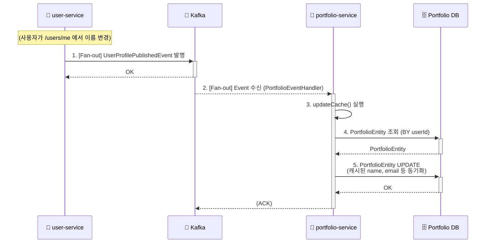
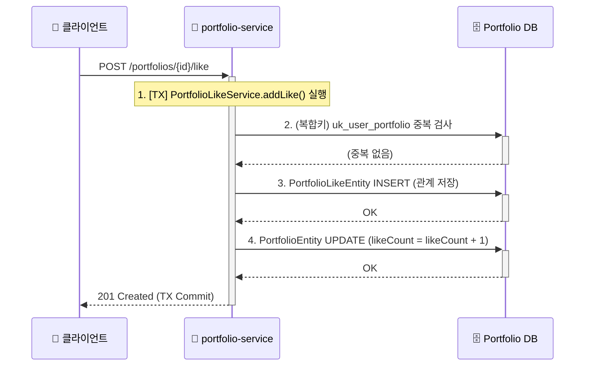

# PORTFOLIO_SERVICE.md

## 1. 개요

`portfolio-service`는 LinkFolio MSA에서 **사용자의 포트폴리오** 및 관련 데이터(관심(Like) 등)를 전문적으로 관리하는 마이크로서비스이다.

이 서비스의 가장 큰 아키텍처적 특징은 데이터 `비정규화(Denormalization)`이다. `user-service`의 사용자 정보(이름, 이메일 등)를 Feign Client를 통해 실시간으로 호출하여 조인하는 대신, Kafka를 통해 `비동기`적으로 데이터를 수신하여 `PortfolioEntity` 내부에 캐시(저장)한다.

이러한 설계는 포트폴리오 목록 조회와 같은 대량 읽기(Read) 작업에서 `user-service`에 대한 동기식 의존성을 제거하여, 시스템 전체의 성능과 장애 격리 수준을 크게 향상시킨다.

---

## 2. 핵심 기능

* **포트폴리오 CRUD**: 사용자는 자신의 포트폴리오를 생성, 조회, 수정할 수 있다 (`getMyPortfolio`, `createOrUpdateMyPortfolio`).
* **포트폴리오 '관심' 기능**: 다른 사용자의 포트폴리오에 '관심'을 추가하거나 취소할 수 있다 (`addLike`, `removeLike`).
* **데이터 동기화 (Kafka Consumer)**: `user-service`로부터 `UserProfilePublishedEvent`를 수신하여 포트폴리오에 캐시된 사용자 정보를 생성하거나 갱신한다.
* **동적 검색 (QueryDSL)**: 직군(position) 필터링 및 `likeCount`, `createdAt` 등 다양한 조건으로 포트폴리오 목록을 정렬 및 검색(Slice)한다.

---

## 3. 데이터 모델 및 비정규화

### 3.1. `PortfolioEntity.java`

`portfolio-service`의 핵심 엔티티는 `PortfolioEntity`이다.

* **소유자**: `userId` 필드는 `auth-service` 및 `user-service`와 공유하는 사용자의 고유 ID(PK)이며, 이 포트폴리오의 소유자를 나타낸다. `Unique` 제약조건이 걸려있어 사용자 한 명당 하나의 포트폴리오만 생성할 수 있다.
* **비정규화된 사용자 정보**: `name`, `email`, `birthdate`, `gender` 필드는 `user-service`가 원본(Source of Truth)을 가진 데이터이다. `PortfolioService`는 이 데이터를 **Kafka를 통해 수신하여 복제 및 캐시**한다.
* **사용자 입력 정보**: `photoUrl`, `oneLiner`, `content`, `position`, `hashtags` 등은 사용자가 `portfolio-service`를 통해 직접 입력하고 수정하는 데이터이다.
* **상태 관리**: `isPublished` (발행 여부), `viewCount` (조회수), `likeCount` (관심수) 필드를 통해 포트폴리오 상태를 관리한다.

### 3.2. `PortfolioLikeEntity.java`

'관심' 관계를 저장하는 엔티티이다.

* `likerId` (관심을 누른 사용자 ID)와 `portfolio` (관심 대상 포트폴리오) 두 컬럼에 `uk_user_portfolio`라는 **복합 유니크 제약조건(Unique Constraint)**이 설정되어 있다.
* 이는 한 명의 사용자가 동일한 포트폴리오에 여러 번 '관심'을 누르는 것을 DB 레벨에서 원천 차단한다.

---

## 4. 데이터 동기화 흐름 (Kafka Consumer)

이 서비스는 SAGA의 최종 소비자(Consumer) 역할을 한다.

* **`PortfolioEventHandler.java`**: `user-service`가 발행(produce)하는 `UserProfilePublishedEvent`를 `@KafkaListener`로 구독한다.
* **흐름 1: 신규 회원가입 (SAGA 완료 시)**
    1.  `user-service`가 프로필 생성을 완료하고 `UserProfilePublishedEvent`를 발행한다.
    2.  `PortfolioEventHandler`가 이벤트를 수신한다.
    3.  `portfolioRepository.findByUserId`로 조회 시 엔티티가 존재하지 않으므로, `else` 분기를 탄다.
    4.  이벤트의 `userId`, `name`, `email` 등의 정보로 **`isPublished(false)`** 상태의 초기 `PortfolioEntity` 레코드를 생성한다.
* **흐름 2: 기존 사용자 프로필 수정 시**
    1.  `user-service`가 `PUT /users/me` 요청을 처리하고 `UserProfilePublishedEvent`를 발행한다.
    2.  `PortfolioEventHandler`가 이벤트를 수신한다.
    3.  `findByUserId`로 `PortfolioEntity`를 찾은 후, `portfolio.updateCache(...)` 메서드를 호출하여 `name`, `email` 등 캐시된 필드를 덮어쓴다(동기화한다).

---

## 5. 비즈니스 로직 및 QueryDSL

### 5.1. `PortfolioService.java`

* **`createOrUpdateMyPortfolio`**:
    * Kafka가 생성한 `PortfolioEntity`를 `authUserId`로 조회한다.
    * `PortfolioRequest` DTO의 값으로 `portfolio.updateUserInput(...)`을 호출하여 사용자 입력 필드를 갱신한다.
    * 이 과정에서 `isPublished` 상태가 `true`로 변경된다.
* **`getPortfolioDetails`**:
    * 비정규화된 `PortfolioEntity`만 조회하므로 Feign Client 호출이 발생하지 않는다.
    * `portfolio.increaseViewCount()`를 호출하여 조회수를 1 증가시킨다(Dirty Checking).
    * 만약 사용자가 인증된 상태(`authUser != null`)라면, `portfolioLikeRepository.existsByLikerIdAndPortfolio`를 호출하여 `isLiked` 상태를 `true/false`로 설정한 후 DTO로 반환한다.

### 5.2. `PortfolioLikeService.java`

'관심' 기능은 `PortfolioLikeEntity` (관계)와 `PortfolioEntity` (카운트 캐시)를 **둘 다 갱신**하는 트랜잭션으로 동작한다.

* **`addLike`**:
    1.  `PortfolioLikeEntity`를 생성하고 `save`한다.
    2.  `portfolio.addLike(portfolioLike)`를 호출하여 `PortfolioEntity`의 `likeCount`를 1 증가시킨다.
* **`removeLike`**:
    1.  `PortfolioLikeEntity`를 조회하여 `delete`한다.
    2.  `portfolio.removeLike(portfolioLike)`를 호출하여 `likeCount`를 1 감소시킨다.

### 5.3. QueryDSL (`*RepositoryImpl.java`)

`config/QueryDslConfig`를 통해 `JPAQueryFactory`를 빈으로 등록한다.

* **`PortfolioRepositoryImpl.java`**: 메인 페이지의 포트폴리오 목록(`searchPortfolioList`)을 조회한다.
* **`PortfolioLikeRepositoryImpl.java`**: '내 관심 목록'(`searchMyLikedPortfolios`)을 조회한다.
* 두 구현체 모두 `positionEq`와 같은 동적 `where`절과, `Pageable`의 `Sort` 객체를 파싱하여 `likeCount`, `createdAt` 등으로 동적 정렬을 수행하는 `applySorting` 로직을 포함하고 있다.

---

## 6. 보안 및 인증 (`SecurityConfig.java`)

`user-service`와 마찬가지로 `InternalHeaderAuthenticationFilter`를 사용하여 게이트웨이 인증을 신뢰한다.

**핵심 차이점**:
* `GET /portfolios` (목록 조회)
* `GET /portfolios/{portfolioId:\d+}` (상세 조회)

위 두 경로는 `permitAll()`로 설정되어 **인증되지 않은 사용자도 포트폴리오를 조회**할 수 있도록 허용한다.

`PortfolioController`는 `@AuthenticationPrincipal AuthUser authUser` 파라미터를 받으며, `permitAll()` 경로에서는 이 값이 `null`로 전달된다. `PortfolioService`는 `authUser`가 `null`인지 여부를 확인하여 '관심' 여부(`isLiked`)를 처리한다.

---

## 7. 주요 설정 (application.yml)

`application.yml`은 `portfolio-service`의 데이터베이스 및 Kafka 소비자 설정을 정의한다.

* **`server.port: 8082`**: `portfolio-service`의 실행 포트를 8082로 지정한다.
* **`spring.datasource` / `spring.jpa`**: `PortfolioEntity` 등을 저장할 MySQL DB 연결 정보를 정의한다.
* **`spring.kafka.consumer`**:
    * `group-id: "portfolio-consumer-group"`: `portfolio-service`의 소비자 그룹을 식별한다.
    * `value-deserializer`: `JsonDeserializer`를 사용한다.
    * `properties.spring.json.trusted.packages` 및 `type.mapping`: `user-service`가 발행한 `UserProfilePublishedEvent`를 `common-module` DTO로 올바르게 역직렬화하기 위한 필수 설정이다.
* **`app.feign.user-service-url`**: `pom.xml`과 `PortfolioServiceApplication`에 Feign Client가 활성화되어 있고, `application.yml`에도 `user-service` URL이 정의되어 있다. 하지만 현재 비즈니스 로직(Kafka 비동기 동기화)으로 인해 **실제 Feign Client 인터페이스가 정의되거나 사용되지는 않고 있다.** 이는 향후 동기식 호출이 필요할 경우를 대비한 설정으로 볼 수 있다.

---
A. 데이터 동기화 (Fan-out Consumer)
#### 

B. 포트폴리오 '관심' 추가 (Like)
#### 

