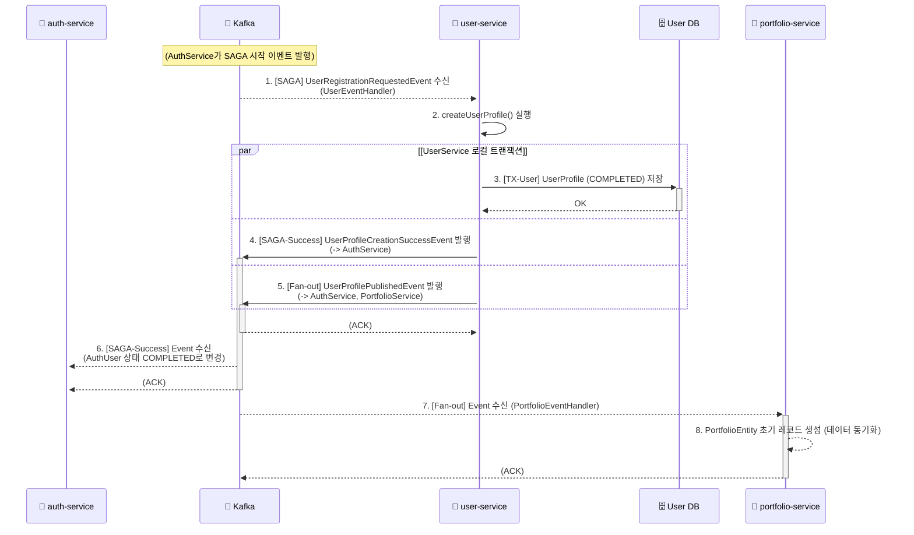

# USER_SERVICE.md

## 1. 개요

`user-service`는 LinkFolio MSA에서 **사용자 프로필 정보**를 전담하여 관리하는 마이크로서비스이다.

`auth-service`가 '인증' 자체(예: 비밀번호, 소셜 계정)를 담당한다면, `user-service`는 '인증된 사용자'의 상세 정보(예: 실명, 생년월일, 성별 등)를 저장하고 관리한다.

이 서비스의 가장 중요한 역할은 `auth-service`로부터 시작된 회원가입 SAGA 트랜잭션의 참여자(Participant)로서, 프로필 생성을 완료하고 그 결과를 다시 `auth-service` 및 다른 서비스들에게 전파(Fan-out)하는 것이다.

---

## 2. 핵심 기능

* **SAGA 트랜잭션 참여**: `auth-service`의 회원가입 요청(`UserRegistrationRequestedEvent`)을 Kafka로 수신하여 사용자 프로필을 생성한다.
* **SAGA 응답 및 전파**:
    1.  **(SAGA 응답)** 프로필 생성 성공/실패 여부를 Kafka(`UserProfileCreationSuccessEvent` / `FailureEvent`)를 통해 `auth-service`로 다시 알린다.
    2.  **(데이터 전파)** 프로필이 생성되거나 수정되면, `UserProfilePublishedEvent`를 발행(Fan-out)하여 `portfolio-service`나 `auth-service` 등 다른 서비스들이 데이터를 동기화할 수 있도록 한다.
* **프로필 관리 API**: `apigateway-service`를 통해 인증된 사용자의 프로필 조회(`GET /users/me`) 및 수정(`PUT /users/me`) API를 제공한다.

---

## 3. SAGA 및 데이터 전파 흐름 (Kafka)

`user-service`의 핵심 로직은 `UserEventHandler`에 집중되어 있다.

### 3.1. SAGA 참여자 (Consumer)

1.  `auth-service`가 `UserRegistrationRequestedEvent`를 발행하면, `UserEventHandler`의 `handleUserRegistrationRequested` 메서드가 이를 수신(@KafkaListener)한다.
2.  이 메서드는 `UserService.createUserProfile`를 호출한다.
3.  `createUserProfile`는 `AuthUserEntity`와 동일한 `userId`를 PK로 갖는 `UserProfileEntity`를 생성한다.
    * `UserProfileEntity`는 `fromEvent` 정적 메서드를 통해 `UserProfileStatus.PENDING` 상태로 생성된다.
    * 즉시 `updateStatus(UserProfileStatus.COMPLETED)`로 상태가 변경된 후 DB에 저장된다.
4.  **(멱등성)** 만약 동일한 `userId`로 이벤트가 중복 수신되더라도, `userRepository.existsById` 검사를 통해 이미 생성된 프로필을 반환하여 멱등성을 보장한다.

### 3.2. SAGA 응답 및 전파 (CDC 기반)

`UserEventHandler`는 프로필 생성 성공/실패 여부에 따라 다르게 동작한다.

* **성공 시 (UserService)**:
    * Java 코드 레벨에서 Kafka 이벤트를 발행하지 않는다.
    * `userRepository.save()`를 통해 DB에 데이터가 저장되면, **Debezium(CDC)**이 Transaction Log를 감지하여 `user_db.user_profile` 토픽으로 이벤트를 자동 발행한다.
    * `auth-service`와 `portfolio-service`는 이 CDC 이벤트를 구독하여 상태를 동기화한다.
* **실패 시 (UserEventHandler catch 블록)**:
    * 예외 발생 시 `KafkaTemplate`을 사용하여 명시적으로 `UserProfileCreationFailureEvent`를 발행한다.
    * 이를 수신한 `auth-service`는 계정 상태를 `CANCELLED`로 변경한다.

### 3.3. 프로필 수정 시 데이터 전파

사용자가 `PUT /users/me` API를 통해 프로필(이름, 생년월일 등)을 수정하면, `UserService.updateUserProfile` 메서드가 호출된다.

이 메서드 또한 **DB만 업데이트**한다. 트랜잭션이 커밋되면 CDC가 자동으로 변경된 이름 등의 정보를 Kafka로 발행(Fan-out)하며, 이를 구독하고 있는 `portfolio-service`와 `auth-service`가 각자의 캐시 데이터를 일관성 있게 갱신한다. 이를 통해 'Dual Write' 문제(DB는 갱신되었으나 메시지 발행 실패)를 원천 차단한다.

---

## 4. 보안 및 인증 (`SecurityConfig.java`)

`user-service`는 `auth-service`와 달리 인증을 직접 수행하지 않고, `apigateway-service`의 인증 결과를 신뢰한다.

* `SecurityConfig`는 `common-module`에 정의된 `InternalHeaderAuthenticationFilter`를 `AuthorizationFilter` 앞에 등록한다.
* 이 필터는 게이트웨이가 주입한 `X-User-Id`, `X-User-Email`, `X-User-Role` 헤더를 읽어 `SecurityContextHolder`에 `AuthUser` 객체를 등록한다.
* 이를 통해 `UserController`는 `@AuthenticationPrincipal AuthUser authUser` 어노테이션을 사용하여 JWT 파싱 없이도 즉시 사용자 ID(`authUser.getUserId()`)를 획득할 수 있다.

---

## 5. 주요 설정 (`application.yml`)

`application.yml`은 `user-service`의 SAGA 참여자 및 데이터 전파자로서의 역할을 정의한다.

* **`server.port: 8080`**: `user-service`의 실행 포트를 8080으로 지정한다.
* **`spring.datasource` / `spring.jpa`**: `UserProfileEntity`를 저장할 MySQL DB 연결 정보를 정의한다.
* **`spring.data.redis`**: `user-service`도 Redis 설정을 포함한다. `RedisConfig`를 보면 `auth-service`와 달리, 값(value)의 직렬화 방식으로 `GenericJackson2JsonRedisSerializer` (JSON)를 사용한다. 이는 `OAuth2AuthorizationRequest` 객체처럼 Java 직렬화가 필수적인 복잡한 객체를 저장할 필요가 없기 때문이다.
* **`spring.kafka`**:
    * **`consumer`**: SAGA 시작(`UserRegistrationRequestedEvent`) 이벤트를 수신(deserialize)하기 위한 설정을 정의한다.
    * **`producer`**: SAGA 응답(`Success/FailureEvent`) 및 데이터 전파(`PublishedEvent`)를 위해 이벤트를 발행(serialize)하는 설정을 정의한다.
    * `properties.spring.json.type.mapping`: `common-module`의 이벤트 DTO를 Kafka 메시지와 매핑하여 올바르게 역직렬화하기 위한 필수 설정이다.

---

## 6. 의존성 관리 (`pom.xml`)

`user-service`의 `pom.xml`은 SAGA 참여 및 데이터 관리에 필요한 의존성들을 포함한다.

* `spring-boot-starter-data-jpa`: `UserProfileEntity` 관리를 위한 JPA 의존성.
* `spring-kafka`: SAGA 이벤트 수신 및 발행을 위한 Kafka 의존성.
* `spring-boot-starter-security`: `SecurityConfig` 및 `InternalHeaderAuthenticationFilter` 적용을 위한 의존성.
* `spring-boot-starter-data-redis`: Redis 연결 및 캐싱(현재 명시적 사용은 적으나 향후 확장용) 의존성.
* `common-module`: `BaseEntity`, `InternalHeaderAuthenticationFilter`, SAGA 이벤트 DTO(`UserRegistrationRequestedEvent` 등)를 공유하기 위한 핵심 의존성.
* `org.mapstruct:mapstruct`: `UserMapper`에서 `UserProfileEntity`를 `UserResponse` DTO 등으로 변환하기 위해 사용된다.

---

#### 

